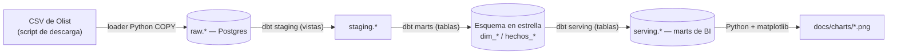
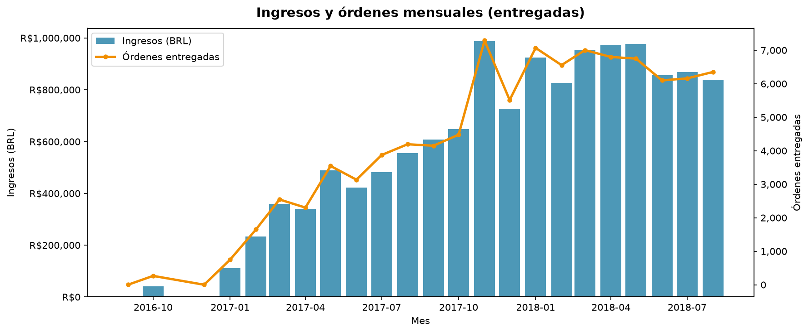
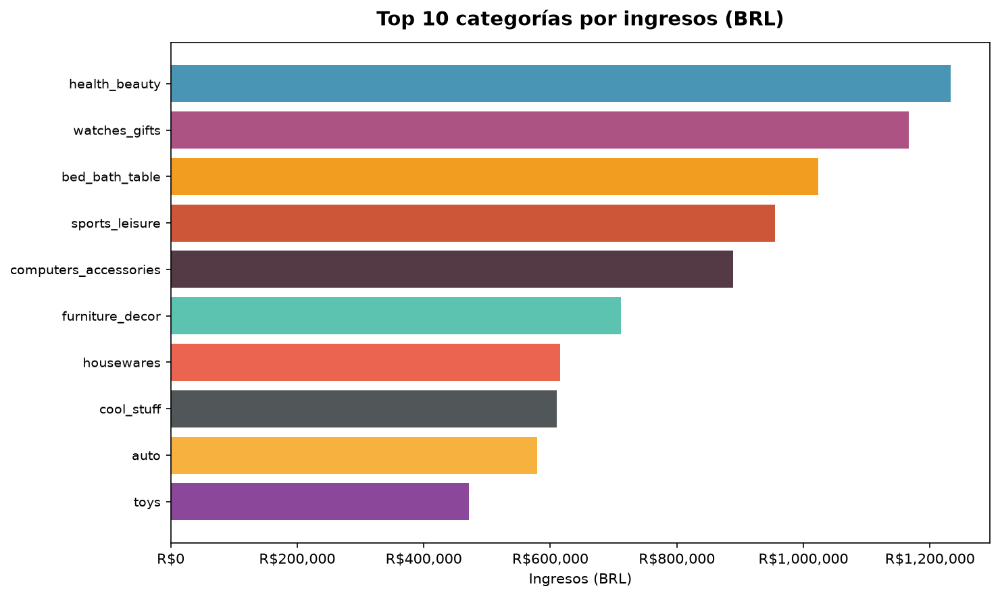
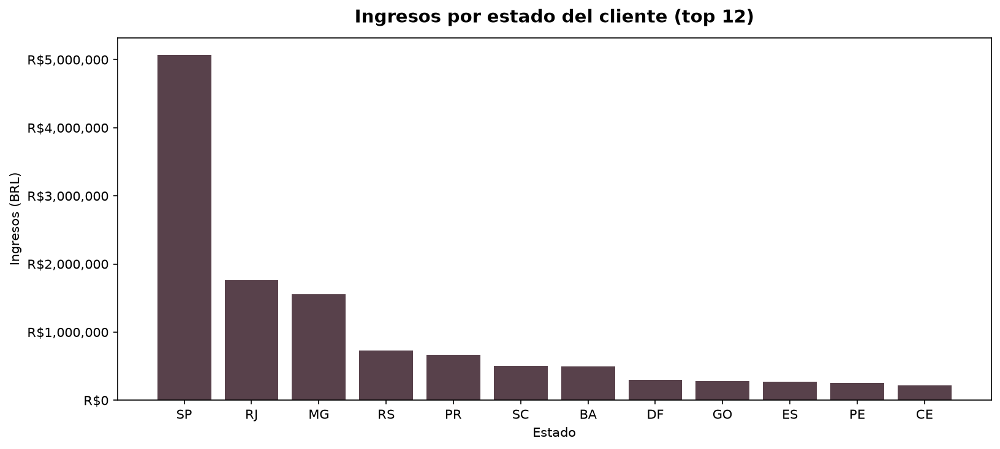
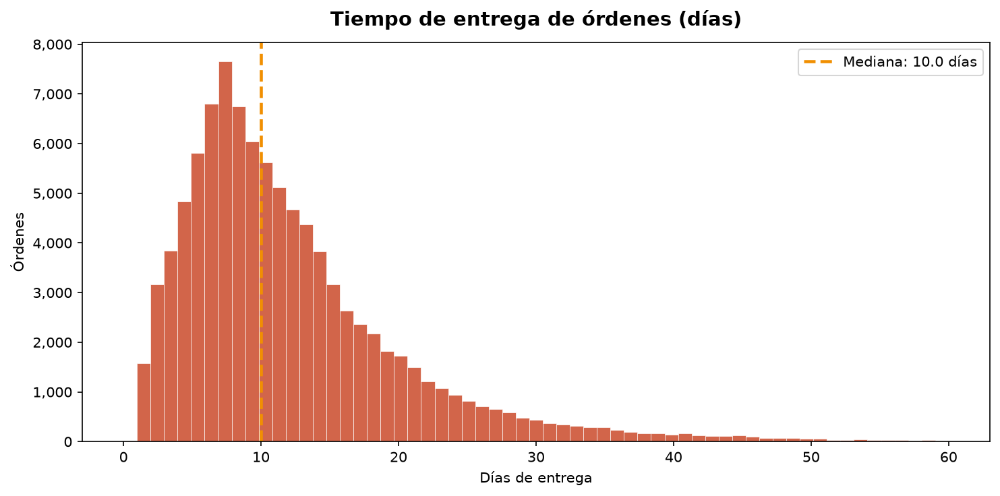
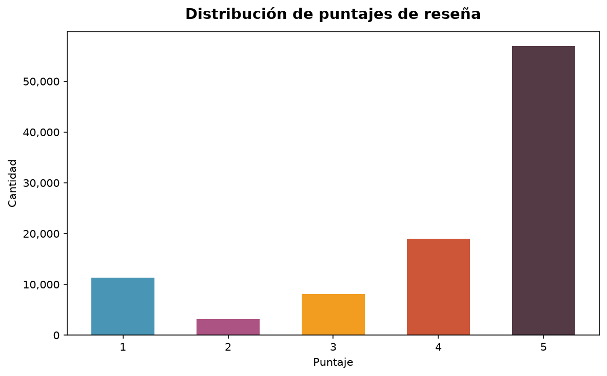
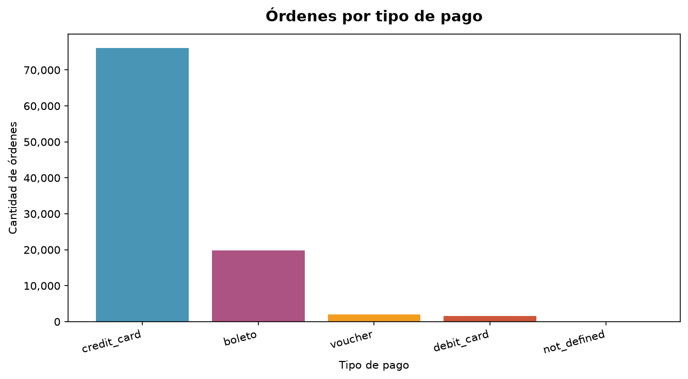

<div align="center">

# Olist BI Analytics

**Analytics sobre e-commerce: modelo dimensional con dbt y gráficos de insights sobre PostgreSQL**

[](https://github.com/JuanAlvarezgh/olist-bi-analytics/actions/workflows/ci.yml)


</div>

Proyecto de analytics engineering sobre el dataset público de e-commerce brasileño de **Olist**
(~100 mil órdenes, 2016–2018). Carga los CSV en PostgreSQL, modela un esquema en estrella y una capa
de servicio para BI con **dbt**, y genera gráficos de insights desde los propios datos.
Todo reproducible con `docker compose up`.

## Objetivo

Demostrar el lado **Data Analyst / Analytics Engineer** del perfil: tomar datos transaccionales crudos
y convertirlos en un modelo dimensional confiable, una capa de métricas y visualizaciones que respondan
preguntas de negocio (¿cómo crecen las ventas?, ¿qué categorías y regiones mandan?, ¿cumple la logística?,
¿qué tan satisfechos están los clientes?). El núcleo de ingeniería es reproducible y testeado, y los
gráficos resumen los hallazgos.

## Arquitectura



## Tecnologías

| Capa | Herramienta |
|---|---|
| Lenguajes | Python 3.11, SQL |
| Carga | `psycopg` 3 con `COPY` → PostgreSQL 16 (idempotente) |
| Transformación | dbt 1.9 (`dbt-postgres`) + `dbt_utils` |
| Visualización | pandas + matplotlib |
| Infraestructura | Docker Compose |
| Calidad | pytest, ruff, tests de dbt |
| CI | GitHub Actions |

## Qué se construyó

- Script reproducible que descarga los 8 CSV de Olist y un **loader Python idempotente** (`COPY`) hacia un esquema `raw`.
- **Proyecto dbt** con tres capas: `staging` (vistas tipadas), `marts` (esquema en estrella Kimball:
  `dim_clientes`, `dim_productos`, `dim_vendedores`, `dim_fecha`, `hechos_ordenes`, `hechos_items_orden`,
  `hechos_resenas`) y `serving` (marts anchas/agregadas para BI), con tests de unicidad, no-nulos,
  relaciones, valores aceptados y rangos.
- **Glosario de métricas** y **6 gráficos de insights** generados desde los marts.
- **CI en GitHub Actions**: ruff + pytest + `dbt build` sobre un fixture pequeño versionado, verificando
  que la salida no quede vacía.

## Decisiones de diseño (el porqué)

- **Esquema en estrella + capa de servicio.** El modelo dimensional (hechos + dimensiones) preserva el
  detalle y la integridad; encima, unas tablas `serving` anchas/agregadas alimentan los gráficos (y
  cualquier herramienta de BI), evitando poner lógica de negocio en la capa de visualización.
- **Integridad por INNER JOIN.** La tabla de hechos se une a sus dimensiones con INNER JOIN, de modo que
  los tests de `relationships` siempre se cumplen y no hay filas huérfanas.
- **Consistencia de métricas.** "Ingresos" se define una sola vez (suma de precio de ítems) y se reutiliza;
  las marts de ventas diarias y por categoría cuadran exactamente (ambas filtran órdenes entregadas).

## Resultados

- **Volumen:** ~**99.441 órdenes**, ~**112.650 ítems**, **96.096 clientes únicos**, **74 categorías** de producto (2016–2018).
- **Modelo:** **18 modelos dbt**, `dbt build` **PASS=48** (modelos + tests), `ruff` limpio, **CI verde**.
- **Negocio (órdenes entregadas):** ingresos ~**R$13,2 M**, **ticket promedio R$137**.

## Hallazgos en los datos

Gráficos generados desde las serving marts con `analysis/make_charts.py` (datos reales). Las métricas
están definidas en el [glosario de métricas](docs/glosario_metricas.md).

### Crecimiento del negocio


Olist pasó de prácticamente cero en septiembre de 2016 a una **meseta de ~R$1 M de ingresos mensuales**
hacia 2018, con ingresos y órdenes moviéndose en paralelo. La curva muestra una fase de crecimiento
acelerado (2017) seguida de estabilización: el marketplace escaló rápido y luego maduró.

### Mezcla de catálogo


Ninguna categoría domina: la líder, **health_beauty, aporta solo el 9,3 %** de los ingresos, seguida de
watches_gifts (8,8 %) y bed_bath_table (7,7 %). El **top 3 suma apenas ~26 %**, señal de un catálogo
**diversificado** donde el ingreso se reparte entre muchas categorías de tamaño medio.

### Concentración geográfica


El mercado está **muy concentrado en el sudeste**: **São Paulo (SP) genera el 38,3 %** de los ingresos
entregados, y junto a Río de Janeiro (13,3 %) y Minas Gerais (11,7 %) suman **~63 %**. Esto revela tanto
la dependencia de SP como una **oportunidad clara de expansión** hacia el resto del país.

### Desempeño logístico


La **mediana de entrega es de 10 días** y el **91,9 % de las órdenes llega en o antes de la fecha
estimada**. La logística cumple las expectativas en la gran mayoría de los casos, con una cola de entregas
largas que es donde se concentra el riesgo de insatisfacción.

### Satisfacción del cliente


La distribución de reseñas es muy positiva: **57,8 % de puntajes 5★ y 77,1 % de 4★ o más** (promedio
**4,09 / 5**). Aun así, queda una **cola de ~23 % con 3★ o menos** —típicamente ligada a entregas tardías—
que marca el principal frente de mejora.

### Medios de pago


El **crédito domina con 76,6 %** de las órdenes, seguido del **boleto (19,9 %)** —medio de pago típico de
Brasil—; débito (1,5 %) y voucher (2,0 %) son marginales. La fuerte presencia del crédito se relaciona con
el uso de **cuotas** ("parcelamento"), una característica del mercado brasileño.

### Retención
Con **96.096 clientes únicos** para 99.441 órdenes, la **tasa de recompra es de apenas 3,4 %**: el negocio
es casi enteramente de **clientes nuevos**, lo que señala una oportunidad importante en fidelización.

## Cómo correrlo

```bash
cp .env.example .env
docker compose up -d                                  # warehouse PostgreSQL (puerto 5434)
python -m scripts.download_data                        # descarga los CSV de Olist a data/
python -m olist_loader.run                             # carga raw.* (COPY)
cd dbt_olist && DBT_PROFILES_DIR=. dbt deps && DBT_PROFILES_DIR=. dbt build && cd ..
python -m analysis.make_charts                         # regenera docs/charts/*.png
```

## Calidad y tests

- **pytest**: el loader carga el fixture `sample/` en Postgres y se verifica la idempotencia (cargar dos veces deja el mismo conteo).
- **Tests de dbt**: `unique`/`not_null` en claves, `relationships` (hechos → dimensiones), `accepted_values`
  (estado de orden), `accepted_range` (puntaje 1–5) y no-vacío en las serving marts.
- **CI**: ruff + pytest + `dbt build` sobre el fixture, con aserción de que la tabla principal de servicio no quede vacía.

## Estructura

```
olist-bi-analytics/
├─ scripts/            # descarga de datos y generación del fixture
├─ olist_loader/       # loader idempotente COPY hacia raw
├─ dbt_olist/          # proyecto dbt: staging, marts (estrella), serving
├─ analysis/           # generación de gráficos desde las serving marts
├─ docs/               # gráficos y glosario de métricas
├─ docker-compose.yml  # warehouse PostgreSQL
└─ .github/workflows/  # CI
```

## Habilidades

SQL, dbt, modelado dimensional, capa de métricas, visualización de datos (matplotlib), calidad de datos
y testing, Python (ETL/COPY), Git / CI (GitHub Actions), Docker.

---

## Contacto

[](https://www.linkedin.com/in/juanalvarezgh)
[](mailto:juanalvarezghcode@gmail.com)
[](https://github.com/JuanAlvarezgh)
